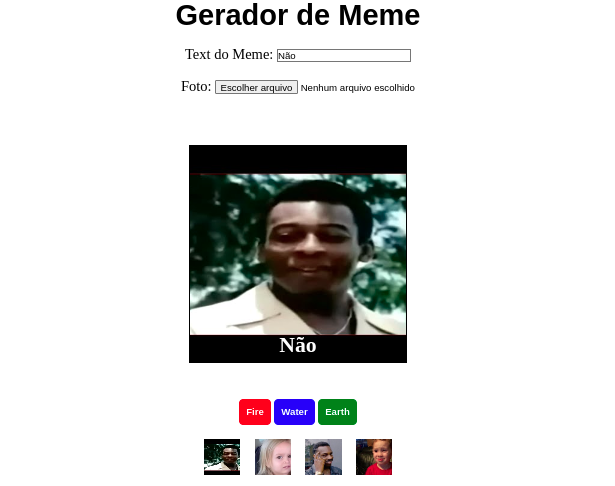

# Meme Generator - Projeto Trybe



## Projeto da Escola Trybe

Este projeto foi desenvolvido como parte da formação de Desenvolvedor Web na Trybe. O objetivo do projeto é criar um gerador de memes utilizando HTML, CSS e JavaScript.

## Tecnologias Utilizadas


# Funcionalidades do Projeto

O projeto "Meme Generator" permite que você:

- Escolha uma imagem de fundo para o meme.
- Adicione texto na inferior da imagem.

## Como Usar

1. Clone o Projeto

```bash
git clone MemeGenerator
```

2. Entre na pasta do projeto

```bash
cd MemeGenerator
```

3. Rode o Projeto

```bash
npm start
```